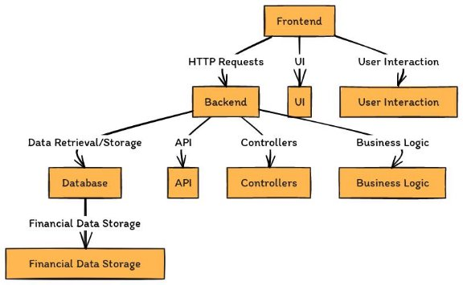
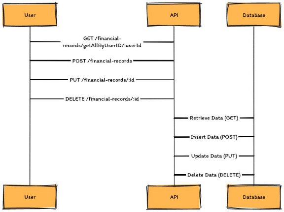
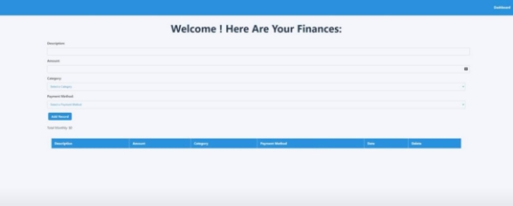

Project Documentation 

**Table of Contents** 

1. Project Description 
1. Software Functionality Diagram 
1. Files and Directory Architecture 
   1. Physical Architecture 
   1. Logical Architecture 
   1. Client-Server Architecture 
1. Database and API Diagrams 
1. Explanation of Each Web View 
   1. Main Web Page 
   1. Other Views 
1. Installation Manual 
1. Code Snippets 
1. **Project Description** 

**Purpose** 

The project aims to be a comprehensive financial tracking tool that provides users with the ability to efficiently manage their personal finances. With this tool, users can: 

- **Add** new financial records to keep a track of their income and expenses. 
- **Update** existing records to reflect changes in their financial situation. 
- **View** a comprehensive list of all their financial transactions in a clear and organized manner. 
- **Delete** records that are no longer needed to maintain a clean database. 

All of this is achieved through a user-friendly web interface that enables users to manage their finances with ease and convenience. 

**Problem it Solves** 

The project addresses the problem of disorganized financial tracking by offering: 

- A single, centralized platform to record and track all financial transactions. 
- An intuitive user interface that allows for easy navigation and record management. 
- Secure and convenient access to financial data, reducing the risk of data loss and inaccuracies. 

**Technologies Used** 

**Frontend:** React, TypeScript, Clerk (for authentication) **Backend:** Node.js, Express 

**Database:** MongoDB 

**Other:** TypeScript, Vite, Yarn 

**Main Features** 

**Authentication:** The application uses Clerk to manage user authentication, providing a secure and user-friendly way to sign in and sign up. 

**CRUD Operations:** 

- **Create:** Users can add new financial records with details such as description, amount, category, and payment method. 
- **Read:** A comprehensive list of all financial records is displayed, allowing users to easily review their financial activity. 
- **Update:** Existing records can be modified to keep the financial data up-to-date. 
- **Delete:** Unwanted records can be removed to keep the data clean. 

**Financial Records Context:** The application uses a centralized context for managing financial records, ensuring that the state is consistent and updated across all components. 

**Client-Server Communication:** The frontend uses RESTful API endpoints provided by the backend to fetch, create, update, and delete financial records, ensuring smooth data flow. 

2. **Software Functionality Diagram** 

This diagram provides a high-level view of how the system's major components interact: 

- **Frontend:** The user interacts with the frontend, built with React. It displays user data and provides forms for adding and managing financial records. 
- **Backend:** The Node.js/Express server processes incoming requests from the frontend. It serves as the intermediary between the frontend and the database. 
- **Database:** The MongoDB database stores the financial data. The backend retrieves and updates data here. 

**Interactions:** 

- The frontend sends HTTP requests to the backend through RESTful API endpoints. 
- The backend receives and processes these requests, interacting with the database to read or write data. 
- The backend then sends a response back to the frontend, which updates the user interface. 
3. **Files and Directory Architecture** 

**Physical Architecture** 

This section illustrates the physical structure of the project's files and folders: 

1. **Client (Frontend)** 
- src/: Contains the main source code for the frontend. 
- src/components/: Reusable UI components that appear throughout the application. 
- src/pages/: Pages that define specific views rendered by the app. 
- public/: Static assets like images and the root HTML file. 
2. **Server (Backend)** 
- src/: Contains backend source code. 
- src/routes/: API endpoint definitions. 
- src/schema/: Defines the database schemas. 

**Logical Architecture** 

This section describes the logical relationships between the project's files and folders: 

**Frontend Components:** The components in src/components/ are reusable pieces used in the pages defined in src/pages/. 

**Backend Routes:** The API routes in src/routes/ use the database schemas from src/schema/ to process API requests. 

**Client-Server Architecture** 

This diagram illustrates how the client and server interact: 

- The frontend communicates with the backend using HTTP requests to RESTful API endpoints. 
- The backend processes these requests, interacts with the database, and returns responses to the frontend. 
4. **Database and API Diagrams** 

This section provides details on the structure of the database: 

**Collections:** 

- **Users:** Stores user data with fields like userId and email. 
- **Financial Records:** Stores financial records linked to users via userId. Fields include recordId, description, amount, category, etc. 

This section lists and describes the API endpoints provided by the backend: 

- **GET** /financial-records/getAllByUserID/:userId: Retrieves all financial records for a specific user. 
- **POST** /financial-records: Adds a new financial record. 
- **PUT** /financial-records/:id: Updates a financial record by its ID. 
- **DELETE** /financial-records/:id: Deletes a financial record by its ID. 
5. **Explanation of Each Web View** 

**Main Web Page** 

This is the primary page where users manage their financial records. Key components include: 

**Financial Record Form:** 

- **Description:** Input field for users to describe the transaction. 
- **Amount:** Input field for the transaction amount. 
- **Category:** Dropdown menu to select a category for the transaction. 
- **Payment Method:** Dropdown menu to select the payment method used. 
- **Add Record Button:** Clicking this button adds the record to the database. 
- **Total Monthly:** Displays the total amount of transactions for the current month. 

**Financial Record Table:** 

- **Columns:** Displays details of all added financial records, including: 
- **Description:** The description of the transaction. 
- **Amount:** The amount of the transaction. 
- **Category:** The selected category for the transaction. 
- **Payment Method:** The payment method used for the transaction. 
- **Date:** The date of the transaction. 
- **Delete:** Provides a button to remove the transaction from the records. 

**Other Views** 

This page provides the login functionality for users to access the application. Key components include: 

- **Third-Party Sign-In Buttons:** Users can sign in using either GitHub or Google accounts. 
- **Email and Password Fields:** For users who prefer traditional login methods, they can input their email address and password. 
- **Sign-In Button:** Clicking this button submits the form to authenticate the user. 
- **Sign-Up Option:** For new users, a link below the sign-in form redirects them to a sign-up page. 
6. **Installation Manual** 
1. Clone the Repository: git clone https://github.com/bigboimo/BizTrack.git 
1. Install Dependencies: 
- Navigate to the client folder: cd client 
- Install yarn: npm install -g yarn 
- Install dependencies: yarn install 
- Update whole package: yarn upgrade 
- Navigate to the server folder: cd ../server 
- Repeat process for server… 
- Yarn’s biggest asset is fluid package management. If there are any errors (there shouldn’t be) it will tell you. Otherwise, the project should run smoothly.  
3. Start the Backend: 
- From the server folder: yarn dev  
- (Must say connected to port and connected to MongoDB)  

  

4. Start the Frontend: 
- From the client folder: yarn dev 

  

The last part is making sure to define Clerk Publishable Key. For safety reasons, it is in a local .env file so it’s not visible on git. Therefore, you will not be able to see it or run the website. I will provide the key here; all you must do is navigate to main.tsx in client then paste it into the below area. This will enable you to easily run the website without creating your own clerk publishable key.  

*// Retrieve the publishable key from environment variables* 

const PUBLISHABLE\_KEY = import.meta.env.VITE\_CLERK\_PUBLISHABLE\_KEY; 

The key is: pk\_test\_aW1tZW5zZS1wYXJyb3QtNjcuY2xlcmsuYWNjb3VudHMuZGV2JA Once you complete all those steps, the website will be up and running locally.  

**7. Code Snippets** 

This section includes examples of key functionalities to provide a brief insight into how the application handles crucial features. 

**Frontend Code Example:** 

**Location:** client/src/context/financial-records-context.tsx 

**Purpose:** This code snippet shows how the frontend retrieves financial records for the logged-in user: 

// Function to fetch financial records for the logged-in user 

const fetchRecords = async () => { 

`  `if (!user) return; 

`  `const response = await fetch( 

`     `http://localhost:3001/financial-records/getAllByUserID/${user.id}    ); 

`  `if (response.ok) { 

`    `const records = await response.json();     setRecords(records); 

`  `} 

}; 

// Effect to fetch records when the user changes useEffect(() => { 

`  `fetchRecords(); 

}, [user]); 

**Backend Code Example:** 

**Location:** server/src/routes/financial-records.ts 

**Purpose:** This snippet demonstrates how the backend handles the retrieval of all financial records by user ID: 

// Route to get all financial records by user ID router.get("/getAllByUserID/:userId", async (req: Request, res: Response) => { 

`  `try { 

`    `const userId = req.params.userId; 

`    `const records = await FinancialRecordModel.find({ userId: userId }); 

`    `if (records.length === 0) { 

`      `return res.status(404).send("No records found for the user.");     } 

`    `res.status(200).send(records);   } catch (err) { 

`    `res.status(500).send(err); 

`  `} 

}); 
